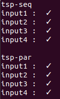

# Documentação e Analises  
* [PDF]()  

# Como Rodar os Testes  
  [Testes]()  

O script test.py é utilizado para testar a integridade do algoritimo implementado, este realiza comparações do resultado de saída do programa com o resultado esperado. Para rodar os testes basta executar o comando python3 test.py, Caso queira adicionar um novo teste deve-se criar um novo arquivo input.txt (entrada para o código principal) dentro da pasta "inputs", assim como um arquivo output.txt (resultado esperado) dentro da pasta "outputs", a estrutura desses arquivos deve seguir os padrões do projeto, definidos na sessão a seguir.  

Em seguida deve-se adicionar o nome destes arquivos recém criados a lista de testes dentro do script. que ao ser exetutado gera o seguinte layout.  

  


## Padrões do Projeto  
Não deve haver espaços vazios no final de cada linha, assim como linhas vazias no final do arquivo  

### Input  
A entrada do programa deve ser conjunto de N pontos x_i, y_i com o seguinte formarto  

```
N  
x_0 y_0  
....  
x_(N-1) y_(N-1)  
```

## Output
O formato de saída será:  
```  
dist opt  
0 e_1 ... e_(N-1)  
```

• dist é o comprimento do caminho encontrado usando 5 casas decimais.  
• e_1 ... e_(N-1) é a sequência de empresas visitadas no trajeto  
• opt é 1 se a solução encontrada é a ótima e 0 se foi usada outra estratégia  